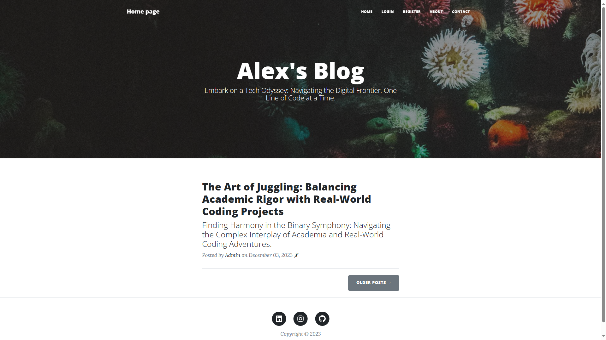
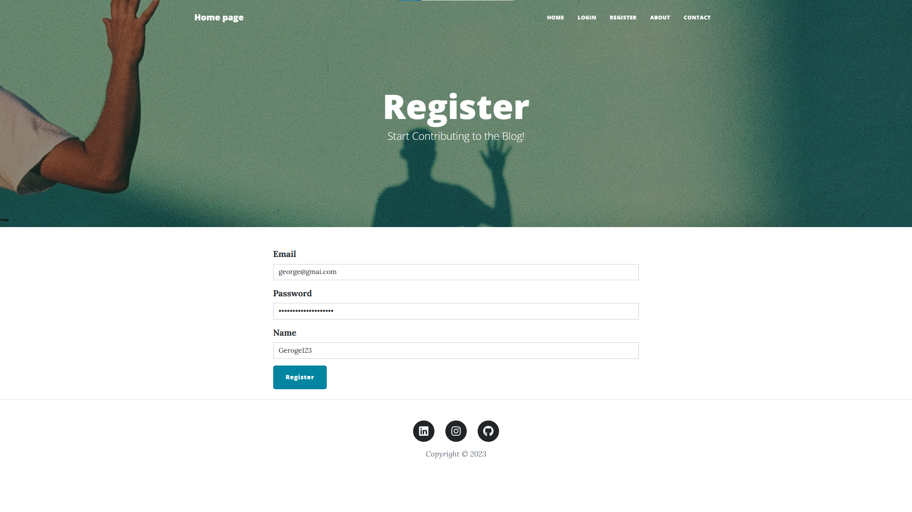
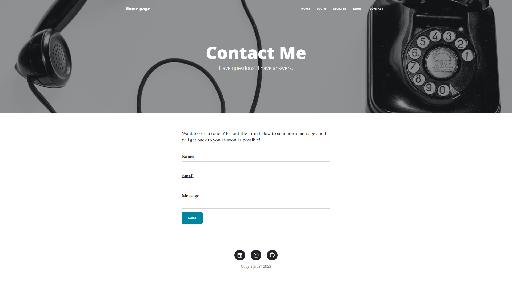

# Personal blog

A robust blog web app powered by Flask, leveraging Werkzeug, SQLAlchemy, Gunicorn, and various other technologies to provide a secure, feature-rich experience. 

## Overview

This blog is a Flask-based web application designed for creating and managing blog posts. The project utilizes a combination of powerful libraries and tools to enhance user experience, security, and functionality.

- **Flask**: The web app is built on Flask, a lightweight and flexible web framework in Python, providing the foundation for the entire application.

- **Werkzeug**: Werkzeug is used for password hashing, ensuring that user passwords are securely encrypted before storage, enhancing the overall security of user accounts.

- **SQLAlchemy**: The application leverages SQLAlchemy to interact with a relational database, seamlessly managing user data, blog posts, and their relationships.

- **Gunicorn**: Gunicorn serves as the production-ready WSGI server, optimizing performance and enabling the deployment of the web app in a scalable and efficient manner.

- **Database Management**: The web app employs a relational database to store user information, blog posts, and comments, ensuring efficient data retrieval and management.

## Features

The application incorporates a range of impressive features to provide a comprehensive and user-friendly experience.

- **User Authentication and Security**: User passwords are encrypted using Werkzeug, providing a secure authentication process. User data, including email, password, and name, is stored and managed in a relational database using SQLAlchemy.

- **Rich Text Editing with Flask_CKEditor**: The integration of Flask_CKEditor allows users to create and edit blog posts with a powerful and intuitive rich text editor, enhancing the content creation experience.

- **Flask_WTF for Form Handling**: Flask_WTF is utilized for handling web forms, simplifying the creation and validation of forms used in user registration, login, and other interactions.

- **Email Notification with smtplib.SMTP**: The web app uses smtplib. SMTP to send email notifications. For instance, when a user submits a contact form, an email notification is sent to the app owner.

## Visual representation







## Installation and Usage Instructions (for End-Users)

To start using this Flask and SQLAlchemy-powered blog application, follow these straightforward steps:

1. **Clone the Repository:**
   Clone the project repository to your local machine using the following command:

   ```bash
   git clone https://github.com/your-username/your-web-app.git
   cd your-web-app
   
- **Install Dependencies:**

    Make sure to install the necessary dependencies by running the following command:

    ```bash
    pip install -r requirements.txt
  
- **Configure the Database Connection:**

    Configure the database connection properties in the config.py file. This includes specifying the database URI and other relevant settings:

    ```bash
    # config.py

    SQLALCHEMY_DATABASE_URI = 'your_database_uri_here'
    # Additional configurations...
  
- **Run the Application:**

   Start the Flask application using the following command:

    ```bash
    python app.py
  
- **Access the Application:**
    
    Open your web browser and navigate to http://localhost:5002 to access the running application. Explore the blog, create posts, and engage with other features.
    
- **Enjoy Blogging:**

    You are now ready to enjoy the full functionality of the blog application. Share your thoughts, create engaging content, and interact with other users.

    Feel free to customize the configurations and settings based on your preferences and project structure.


